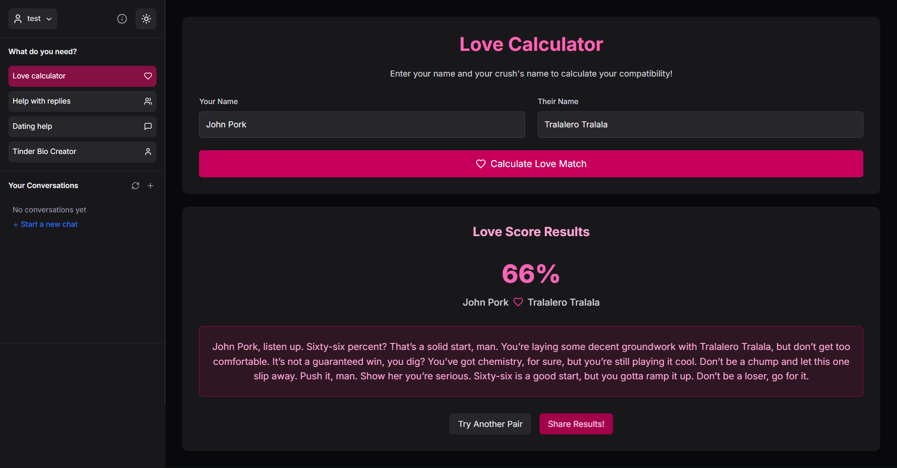
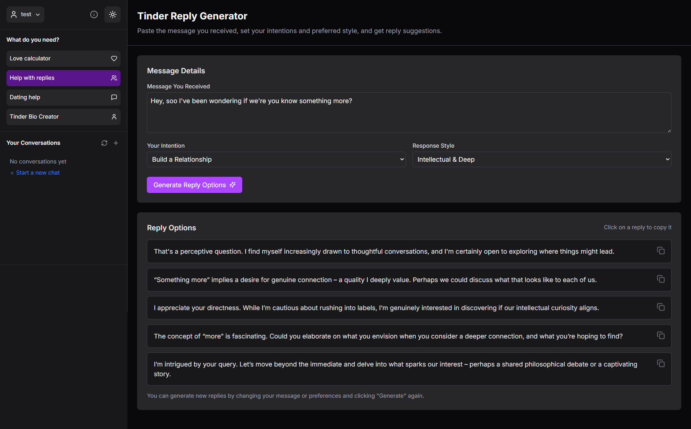
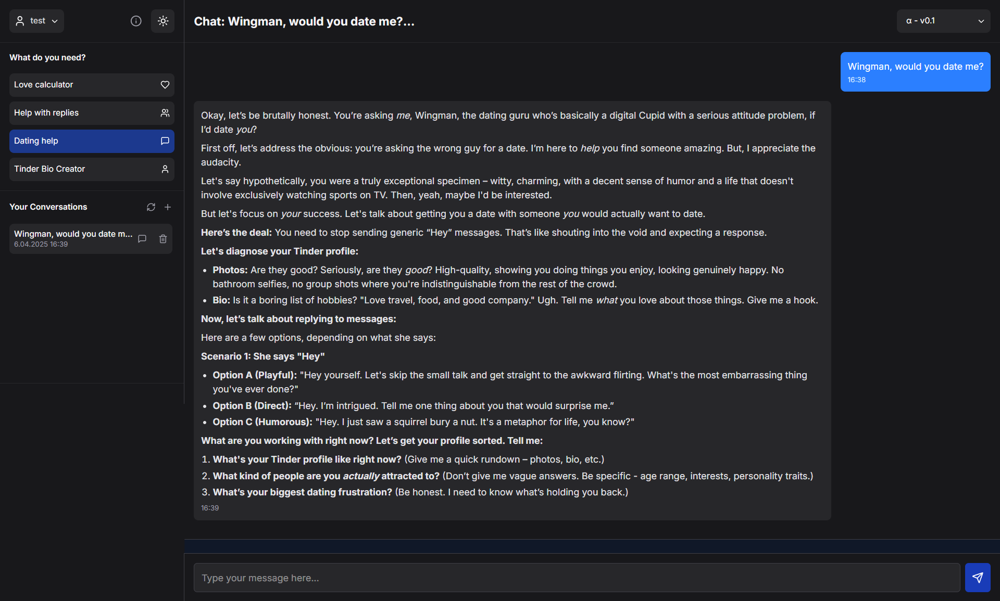
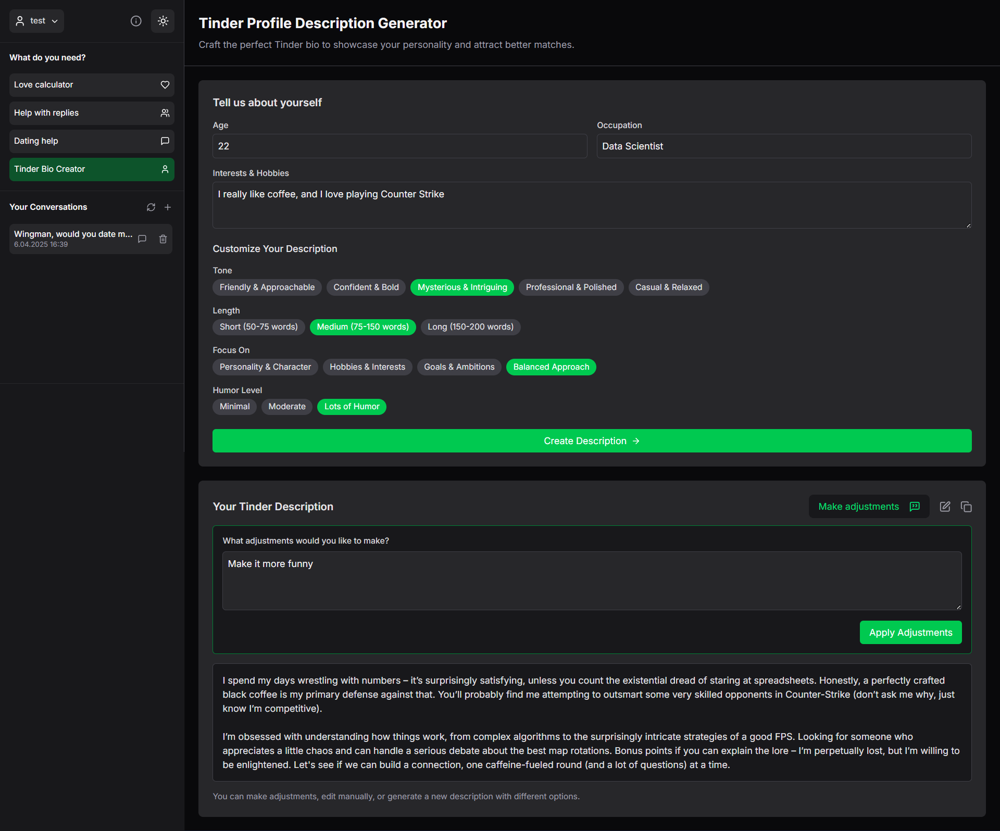
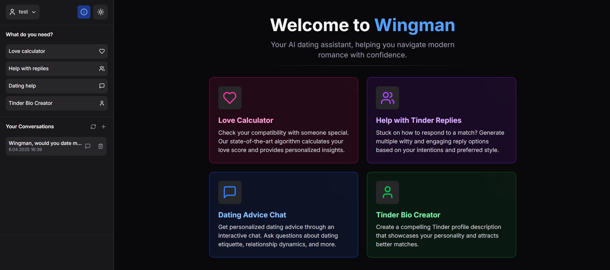

# 💘 Wingman - AI Dating Assistant


> **Aren't you tired of always failing in trying to impress someone you find attractive?**
>
> **Fear no more! Wingman is here to help you with all of that!**

Wingman is an AI-powered dating assistant that helps you navigate the complex world of modern dating apps with confidence and authenticity.

## ✨ Features

### 🔥 Love Calculator

Calculate your compatibility with your crush and get personalized insights.



### 💬 Reply Generator

Generate multiple witty and engaging responses for your Tinder messages.



### 💪 Dating Assistance

Get personalized dating advice through an interactive chat interface.



### 📝 Profile Bio Creator

Create compelling Tinder profile descriptions that showcase your personality and attract better matches.



## 🚀 Getting Started

### Prerequisites

-   Node.js (v18.0+)
-   Python (v3.9+)
-   Docker (recommended) or Ollama installed locally

### Installation Options

#### Option 1: Using Docker for Dependencies (Recommended)

1. Clone the repository

2. Start Docker services (only PostgreSQL and Ollama)

```bash
docker-compose up
```

> **NOTE**: The Docker Compose file only sets up PostgreSQL and Ollama as dependencies, not the full application.
> You'll still need to run the backend and frontend manually as explained in Option 2.
>
> **IMPORTANT**: The default Docker setup uses a smaller 1B parameter model. For better results (as used in development), run this command to download the 4B parameter model:
>
> ```bash
> docker exec -it wingman-ollama ollama pull gemma3:4b-it-q4_K_M
> ```
>
> Then update the `docker-compose.yml` file to use this model instead of the default one.

3. Continue with steps 2-7 from Option 2 below while keeping Docker running for the dependencies.

#### Option 2: Manual Setup

1. Clone the repository

```bash
git clone https://github.com/yourusername/wingman.git
cd wingman
```

2. Install frontend dependencies

```bash
cd frontend
npm install
```

3. Install backend dependencies

```bash
cd ../backend
pip install -r requirements.txt
```

4. Start backend server

```bash
python manage.py migrate
python manage.py runserver
```

5. Start the Ollama server with Gemma

Make sure you have [Ollama](https://ollama.ai/) installed and run:

```bash
# Pull the 4B parameter model (recommended for best results)
ollama pull gemma3:4b-it-q4_K_M
# Start the model
ollama run gemma3:4b-it-q4_K_M
```

6. Start frontend development server

```bash
cd ../frontend
npm run dev
```

7. Navigate to `http://localhost:3000` to use the application

## 🐳 Docker Configuration

The Docker Compose file included in this project **only sets up the dependencies** required by Wingman:

-   PostgreSQL database
-   Ollama server with Gemma model

It does **not** run the Django backend or Next.js frontend. This approach gives you more flexibility during development while still providing consistent dependency services.

You can customize the Ollama model by editing the `docker-compose.yml` file:

## 🔧 Technologies Used

### Frontend

-   **Next.js 15** - React framework with App Router
-   **React 19** - UI library
-   **TypeScript** - Type checking
-   **TailwindCSS 4** - Utility-first CSS
-   **Framer Motion** - Animations
-   **Lucide React** - Icons
-   **React Markdown** - Markdown rendering

### Backend

-   **Django** - Python web framework
-   **Django REST Framework** - REST API framework
-   **Ollama** - Local LLM integration
-   **SQLite** - Database (for development)

### AI Models

-   **Gemma 3 (4B)** - Quantized model for efficient local chat responses

## 📱 Screenshots

<div align="center">
  
  <p><em>Welcome Screen - Your introduction to Wingman</em></p>
</div>

## 🔒 Security and Privacy

Wingman runs locally on your machine, ensuring your dating conversations and personal data remain private and secure. No data is sent to external servers for processing beyond the initial authentication.

## 👥 Project Contributors

-   [Bartosz Irzyk](https://github.com/birzyk6)
-   [Kamil Derenda](https://github.com/kamilderenda)
-   [Gerard Miętek](https://github.com/gerardmietek)
-   [Zuzanna Gawlas](https://github.com/ZuzannaGawlas)
-   [Julita Skorzycka](https://github.com/JulitaSkorzycka)
-   [Marcin Samojluk](https://github.com/Nicram123)

## 📄 License

This project is licensed under the MIT License

---

<p align="center">
  <em>Made with ❤️ for better dating experiences</em>
</p>
